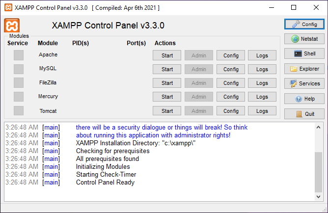
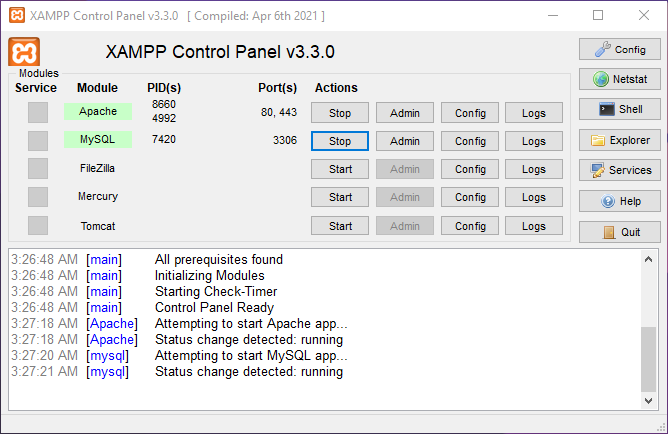

# CSE 208: Database Madness

In this course, we will learn the practical applications of a **Relational Database** by writing and understanding **SQL queries**. We will use **XAMPP** to execute the SQL queries on our local machine.

📌 [**Useful Resources**](#useful-resources)

📌 [**SQL Cheat Sheet**](./cheatsheet.md)

## Installing XAMPP

Here is how we install **XAMPP** on **Windows**:

-   Head over to the [**downloads page**](https://www.apachefriends.org/download.html) and download the appropriate version. We will download the latest version, which is **v8.2.12** at the time of writing

-   Run the setup executable. Make sure to keep the installation directory to:

    ```
    C:\xampp
    ```

-   It will prompt us to run the **XAMPP Control Panel** once the setup has completed

## Activating the Database

The XAMPP Control Panel should look like this:



Now we have to **start** the `Apache` and `MySQL` modules:



Having done that, we open **Google Chrome** or **Firefox** and navigate to the following URL:

```
http://localhost/phpmyadmin/
```

## Useful Resources

[ **How to install XAMPP on Windows 11 (Updated 2025)**](https://youtu.be/UjAbsItMPRY)
