# Mid Assignment

The schema definition of some relations are given as the following:

<strong>customer</strong> (<ins>customer_name</ins>, customer_street, customer_city)
<br><strong>loan</strong> (<ins>loan_number</ins>, branch_name, amount)
<br><strong>borrower</strong> (<ins>customer_name, loan_number</ins>)
<br><strong>account</strong> (<ins>account_number</ins>, branch_name, balance)
<br><strong>depositor</strong> (<ins>customer_name, account_number</ins>)
<br><strong>branch</strong> (<ins>branch_name</ins>, branch_city, assets)

## Data Tables

> [!NOTE]
> Using the data tables from the [**second**](https://github.com/ShadowShahriar/cse208/tree/main/lab-reports/02-2025-07-30) and [**third lab**](https://github.com/ShadowShahriar/cse208/tree/main/lab-reports/03-2025-08-06).

<p align="center">
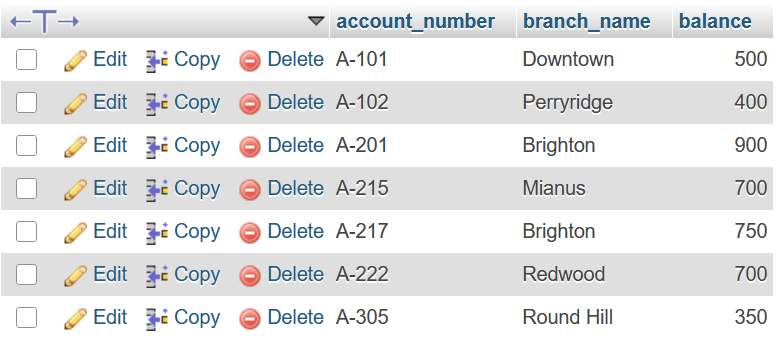
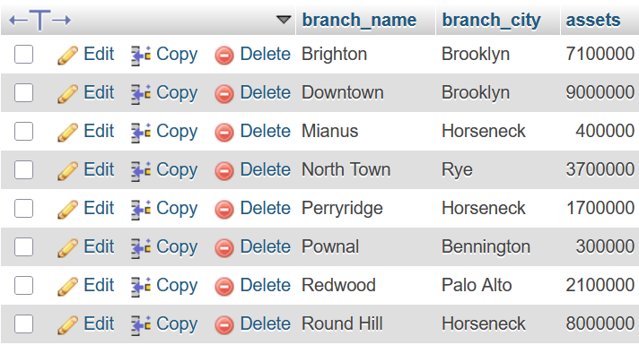
<br>
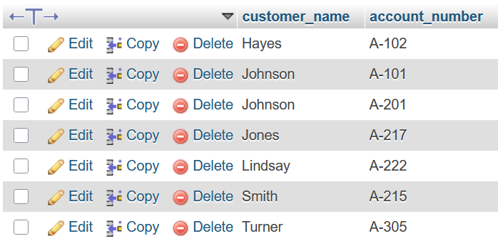
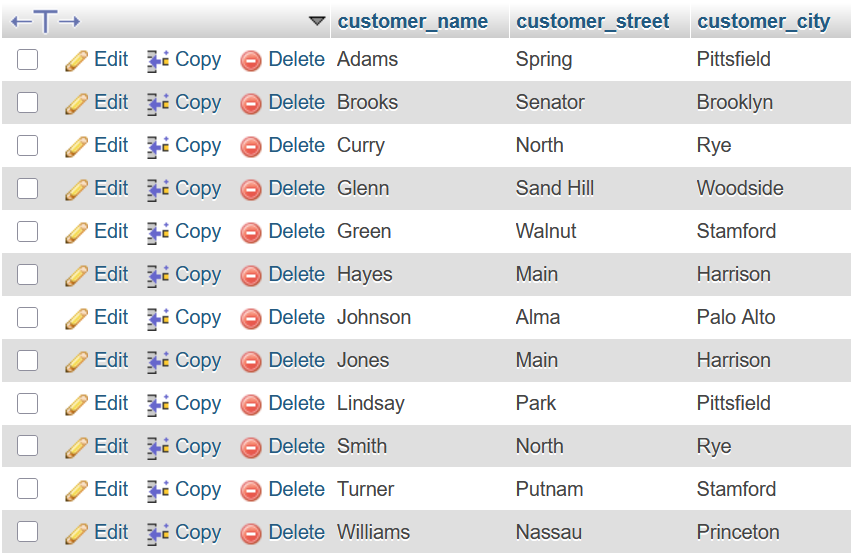
<br>
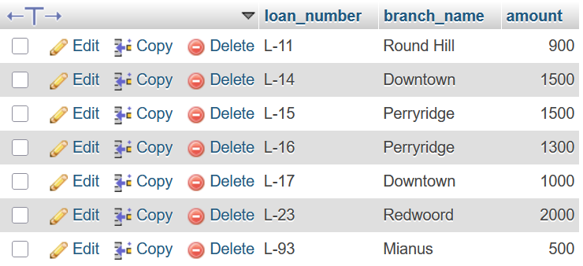
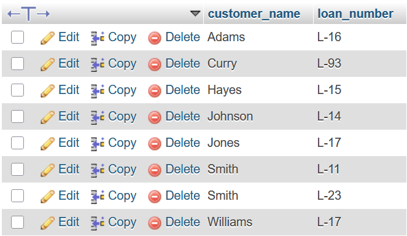
</p>

# Tasks

## Q1. Draw the schema diagram from the given relations

```
loan.branch_name         --> branch.branch_name
account.branch_name      --> branch.branch_name
borrower.customer_name   --> customer.customer_name
borrower.loan_number     --> loan.loan_number
depositor.customer_name  --> customer.customer_name
depositor.account_number --> account.account_number
```

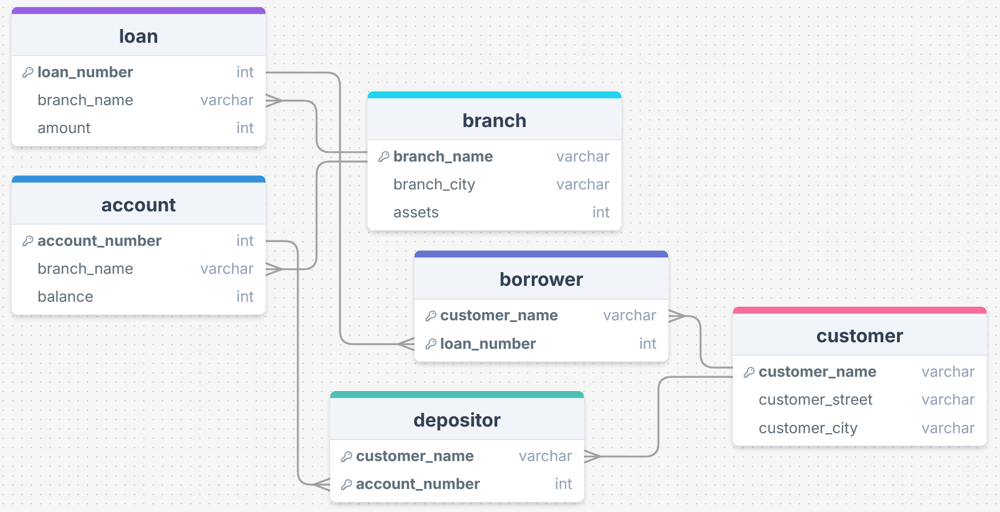

## Q2. Write down the SQL and relational algebra expressions for the questions below

### 1. Find the average loan amount from each branch

**SQL:**

```sql
SELECT branch_name, AVG(amount) "Average Loan" FROM loan
GROUP BY branch_name;
```

**Relational Algebra:**

```math
\Large_{branch\_name}G_{AVG(amount)\ as\ "Average\ Loan"} (Loan)
```

or

```math
\Largeγ_{branch\_name,\ AVG(amount)} (Loan)
```

### 2. Write a query to show the details of a customer whose street name has two consecutive "s"

**SQL:**

```sql
SELECT * FROM customer
WHERE customer_street LIKE "%ss%";
```

**Relational Algebra:**

```math
\Largeσ_{customer\_street\ LIKE\ "\%ss\%"} (Customer)
```

### 3. Find all customers who have a loan from the bank, find their names and loan numbers

**SQL:**

```sql
SELECT customer_name, loan_number
FROM borrower;
```

**Relational Algebra:**

```math
\Largeπ_{customer\_name,\ loan\_number} (Borrower)
```

### 4. Find the list of all customers in alphabetic order who have a loan in the "Perryridge" branch

**SQL:**

```sql
SELECT DISTINCT customer_name
FROM borrower NATURAL JOIN loan
WHERE branch_name = 'Perryridge'
ORDER BY customer_name ASC;
```

**Relational Algebra:**

```math
\Large\tau_{customer\_name} \; (\pi_{customer\_name} (\sigma_{branch\_name = "Perryridge"} (Borrower\ ⨝\ Loan)))
```

### 5. Find all customers having a loan, an account, or both at the bank

**SQL:**

```sql
SELECT customer_name FROM borrower
UNION SELECT customer_name FROM depositor;
```

**Relational Algebra:**

```math
\Largeπ_{customer\_name}(Borrower) ∪ π_{customer\_name}(Depositor)
```

### 6. Find the names of all customers whose street address includes the substring "Main"

**SQL:**

```sql
SELECT customer_name FROM customer
WHERE customer_street LIKE "%Main%";
```

**Relational Algebra:**

```math
\Largeπ_{customer\_name} (σ_{customer\_street\ LIKE\ "\%Main\%"} (Customer))
```

### 7. Find the average loan amount from each branch where the average loan amount is greater than 1500

**SQL:**

```sql
SELECT branch_name, AVG(amount) FROM loan
GROUP BY branch_name
HAVING AVG(amount) > 1500;
```

**Relational Algebra:**

```math
\Largeγ_{branch\_name,\ AVG(amount)}\ σ_{AVG(amount)\ >\ 1500} (Loan)
```

### 8. Count the number of tuples in the customer relation

**SQL:**

```sql
SELECT COUNT(customer_name) FROM customer;
```

**Relational Algebra:**

```math
\Large G_{COUNT(customer\_name)} (Customer)
```

### 9. Find the average account balance, maximum account balance at each branch

**SQL:**

```sql
SELECT branch_name, AVG(balance), MAX(balance) FROM account
GROUP BY branch_name;
```

**Relational Algebra:**

```math
\Large γ_{branch\_name,\ AVG(balance),\ MAX(balance)} (Account)
```

### 10. Find the names of all those customers who have a loan at Perryridge branch

**SQL:**

```sql
SELECT customer_name
FROM borrower NATURAL JOIN loan
WHERE branch_name = "Perryridge";
```

**Relational Algebra:**

```math
\Large π_{customer\_name} ( σ_{branch\_name="Perryridge"} (Borrower\ ⨝\ Loan))
```

### 11. Delete the records of all accounts with balances below the average at that bank

**SQL:**

```sql
DELETE FROM account
WHERE balance < (
    SELECT AVG(balance)
    FROM account
);
```

**Relational Algebra:**

```math
\Large Account ← Account − σ_{balance\ <\ AVG(balance)} (Account)
```

### 12. Show Output

Consider the following tables `loan` and `borrower`. Perform **RIGHT OUTER JOIN**, **LEFT OUTER JOIN**, **INNER JOIN**, and **NATURAL JOIN** operations and show the results.

Performing a **RIGHT OUTER JOIN**:

```sql
SELECT * FROM loan NATURAL RIGHT OUTER JOIN borrower;
```

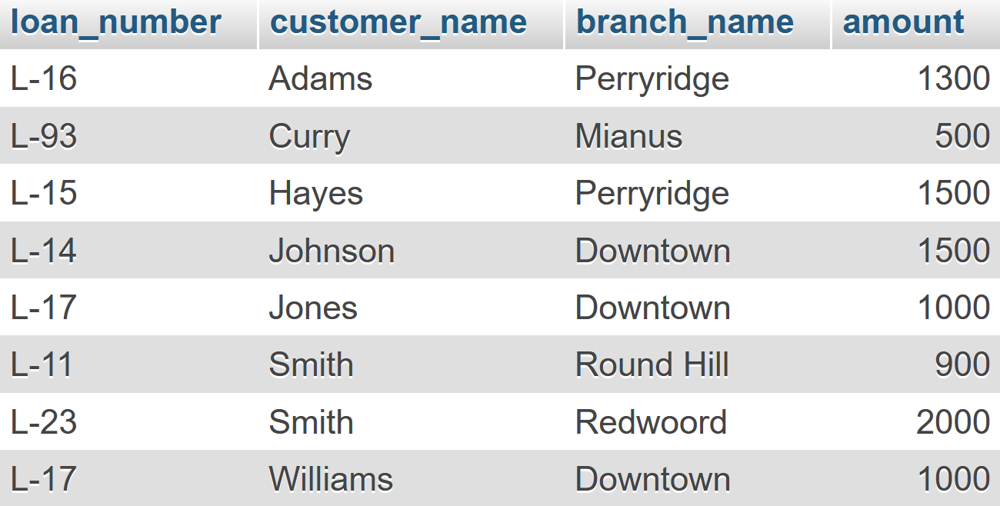

Performing a **LEFT OUTER JOIN**:

```sql
SELECT * FROM loan NATURAL LEFT OUTER JOIN borrower;
```

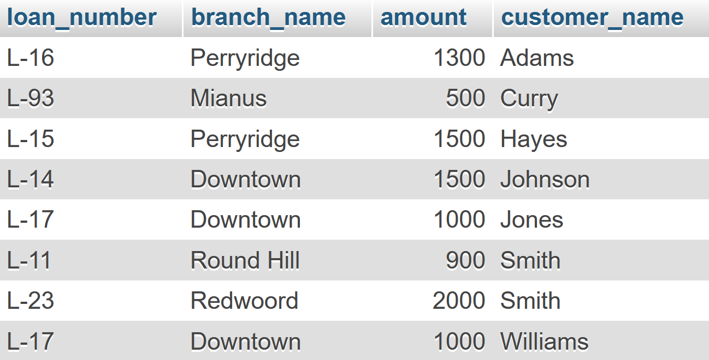

Performing an **INNER JOIN**:

```sql
SELECT * FROM loan INNER JOIN borrower;
```

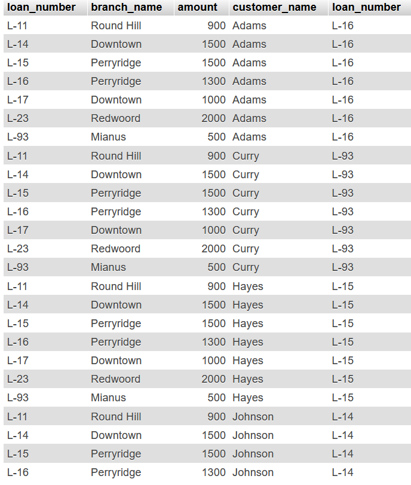

Performing a **NATURAL JOIN**:

```sql
SELECT * FROM loan NATURAL JOIN borrower;
```

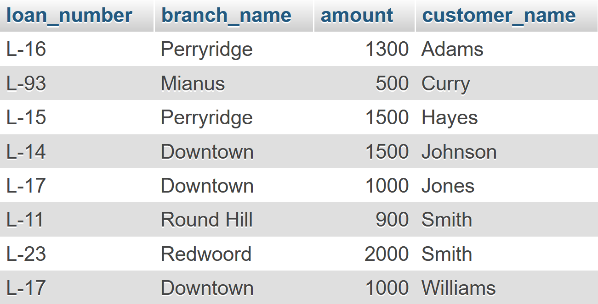

## Q3. Demonstrate the output of the above questions from Question 2 (1-10)

### 1. Find the average loan amount from each branch

**SQL:**

```sql
SELECT branch_name, AVG(amount) "Average Loan" FROM loan
GROUP BY branch_name;
```

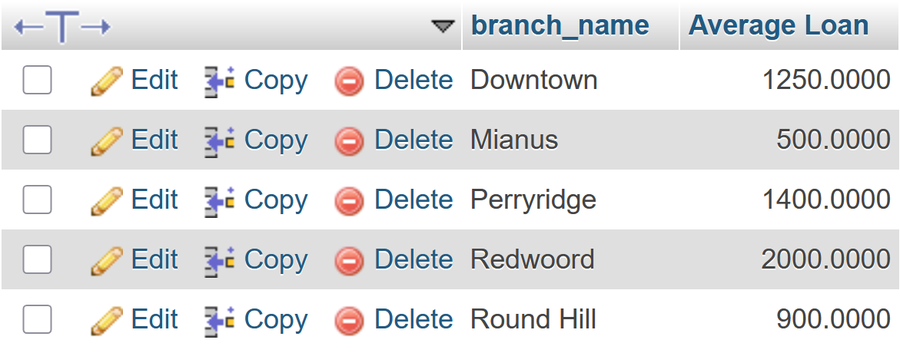

### 2. Write a query to show the details of a customer whose street name has two consecutive "s"

**SQL:**

```sql
SELECT * FROM customer
WHERE customer_street LIKE "%ss%";
```

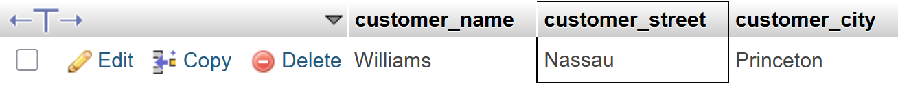

### 3. Find all customers who have a loan from the bank, find their names and loan numbers

**SQL:**

```sql
SELECT customer_name, loan_number
FROM borrower;
```


### 4. Find the list of all customers in alphabetic order who have a loan in the "Perryridge" branch

**SQL:**

```sql
SELECT DISTINCT customer_name
FROM borrower NATURAL JOIN loan
WHERE branch_name = 'Perryridge'
ORDER BY customer_name ASC;
```

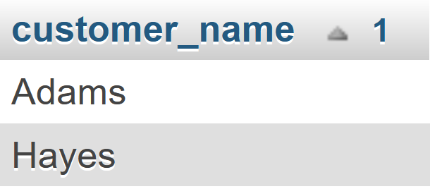

### 5. Find all customers having a loan, an account, or both at the bank

**SQL:**

```sql
SELECT customer_name FROM borrower
UNION SELECT customer_name FROM depositor;
```

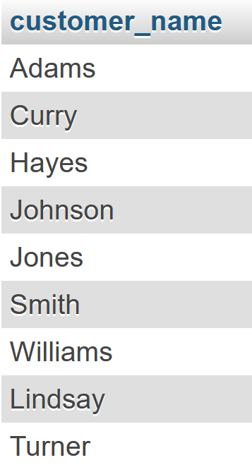

### 6. Find the names of all customers whose street address includes the substring "Main"

**SQL:**

```sql
SELECT customer_name FROM customer
WHERE customer_street LIKE "%Main%";
```

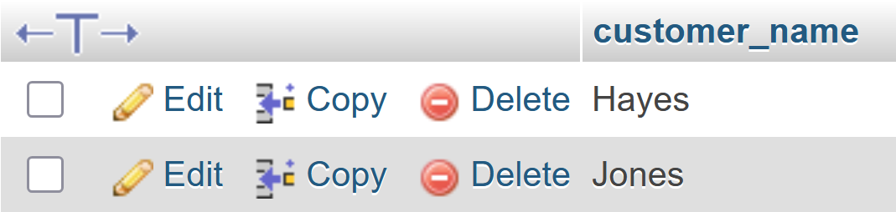

### 7. Find the average loan amount from each branch where the average loan amount is greater than 1500

**SQL:**

```sql
SELECT branch_name, AVG(amount) FROM loan
GROUP BY branch_name
HAVING AVG(amount) > 1500;
```

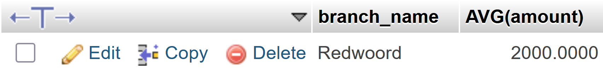

### 8. Count the number of tuples in customer relation

**SQL:**

```sql
SELECT COUNT(customer_name) FROM customer;
```

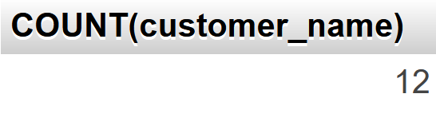

### 9. Find the average account balance, maximum account balance at each branch

**SQL:**

```sql
SELECT branch_name, AVG(balance), MAX(balance) FROM account
GROUP BY branch_name;
```

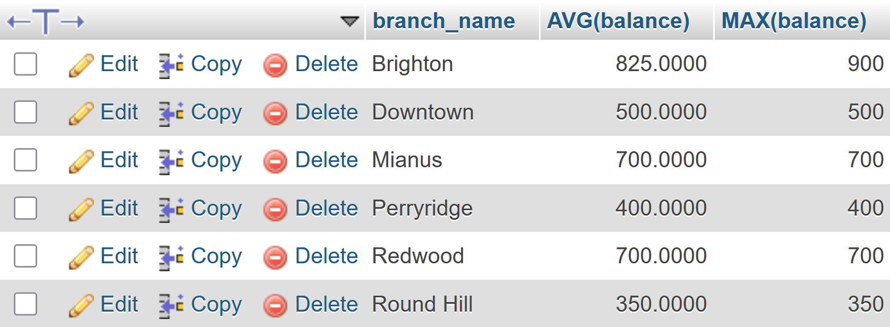

### 10. Find the names of all those customers who have a loan at Perryridge branch

**SQL:**

```sql
SELECT customer_name
FROM borrower NATURAL JOIN loan
WHERE branch_name = "Perryridge";
```

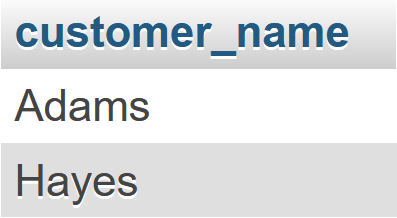

## Q4. Identify all possible superkeys and candidate keys

Given relation:

```
Employee (EmpID, Name, Email, Phone, Department)
```

In the Employee relation:

-   **EmpID** is unique (potential Primary Key).
-   **Email** and **Phone** are usually unique.
-   **Name** and **Department** are not unique because two employees can have the same name or work in the same department.

Therefore, potential candidate keys are: `{EmpID}`, `{Email}`, `{Phone}`

We know that, a superkey is any set of attributes that uniquely identifies a tuple. **Any superset of a candidate key is also a superkey.**

Possible superkeys are:

-   `{EmpID}`
-   `{Email}`
-   `{Phone}`
-   `{EmpID, Name}`, `{EmpID, Email}`, `{EmpID, Phone}`, `{EmpID, Department}`, ...
-   `{Email, Name}`, `{Email, Phone}`, `{Email, Department}`, ...
-   `{Phone, Name}`, `{Phone, Department}`, ...
-   `{EmpID, Name, Email, Phone, Department}`

Basically all subsets that contain **at least one candidate key**.

Again, candidate keys are minimal superkeys (no attribute can be removed without losing uniqueness)

Therefore, candidate keys are: `{EmpID}`, `{Email}`, `{Phone}`.
