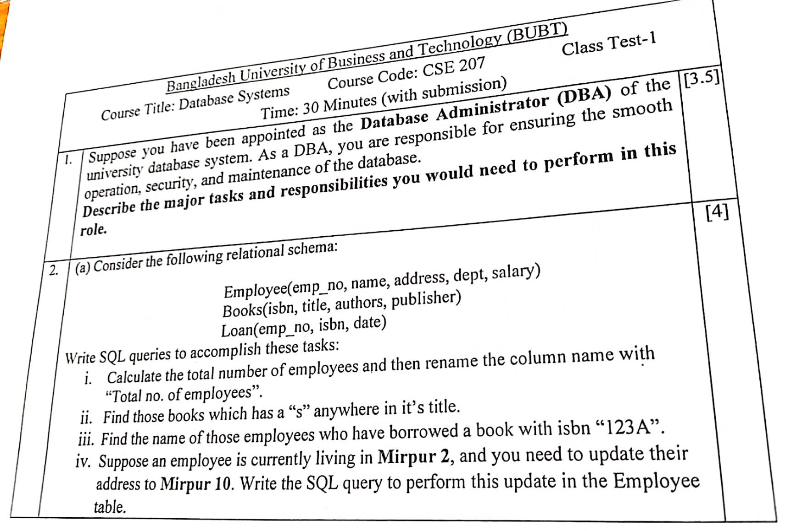

# Class Test 1



## Answer to the Question no. 1

Major Tasks and Responsibilities of a Database Administrator (**DBA**):

1. **Database Installation and Configuration**

    - Set up the university database management system (DBMS).
    - Configure hardware and software requirements for optimal performance.

2. **Database Design and Development**

    - Design the structure of the database (tables, relationships, schemas).
    - Ensure normalization and efficient data organization.

3. **User Management and Access Control**

    - Create and manage user accounts for students, faculty, and staff.
    - Implement role-based access control to ensure only authorized users can access sensitive data.

4. **Database Security**

    - Protect sensitive university data (student records, grades, staff information).
    - Apply encryption, firewalls, and authentication mechanisms.
    - Monitor for suspicious activities and prevent unauthorized access.

5. **Backup and Recovery**

    - Establish regular database backup schedules.
    - Develop recovery plans in case of data loss, corruption, or system failure.

6. **Performance Monitoring and Optimization**

    - Monitor database performance (queries, indexing, storage).
    - Optimize queries, manage indexes, and tune the system for efficiency.

7. **Maintenance and Updates**

    - Apply patches, updates, and upgrades to the DBMS.
    - Ensure compatibility with university applications and systems.

8. **Data Integrity and Consistency**

    - Implement constraints, triggers, and rules to maintain accurate and consistent data.
    - Regularly check for errors, redundancy, and anomalies.

9. **Documentation and Policies**

    - Maintain proper documentation of database structures, security protocols, and backup procedures.
    - Establish policies for database usage, security, and disaster recovery.

10. **Collaboration and Support**

    - Provide support to faculty, staff, and students in using the database.
    - Work with developers, IT staff, and management to meet new requirements.

## Answer to the Question no. 2

Given relational schema:

```sql
Employee(emp_no, name, address, dept, salary)
Books(isbn, title, authors, publisher)
Loan(emp_no, isbn, date)
```

Writing the SQL queries for the following tasks:

1. Calculate the total number of employees and then rename the column name with "Total no. of employees"

    ```sql
    SELECT COUNT(*) "Total no. of employees"
    FROM Employee;
    ```

2. Find those books which has a `s` anywhere in its title.

    ```sql
    SELECT *
    FROM Books
    WHERE title LIKE '%s%';
    ```

3. Find the name of those employees who have borrowed a book with isbn `123A`

    ```sql
    SELECT * FROM employee WHERE emp_no=(SELECT emp_no FROM loan WHERE isbn="123A");
    ```

4. Suppose an employee is currently in living in **Mirpur 2**, and you need to update their address to **Mirpur 10**. Write the SQL query to perform this update in the `Employee` table.

    ```sql
    UPDATE Employee
    SET address = 'Mirpur 10'
    WHERE address = 'Mirpur 2';
    ```
