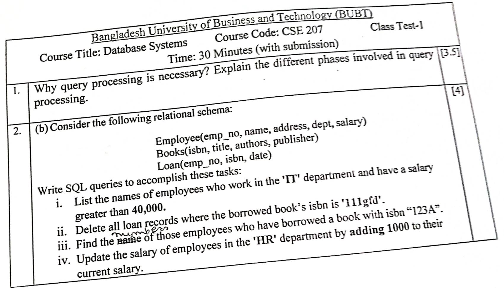
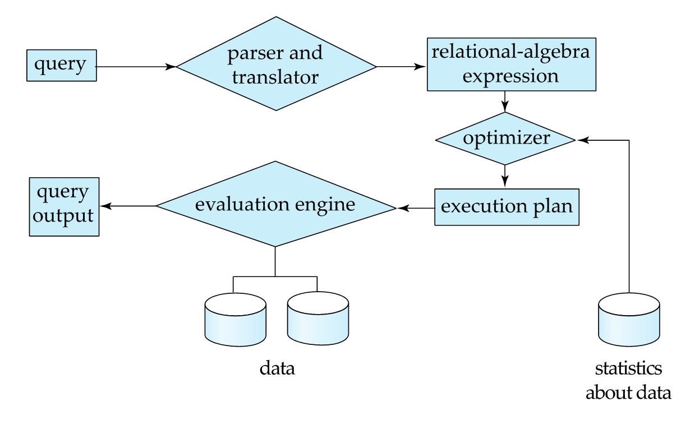

# Class Test 1



## Answer to the Question no. 1

Query processing in a relational database management system (RDBMS) is the systematic process of translating high-level query (e.g. SQL) language to low-level machine language. It is a fundamental component of any RDBMS, directly impacting the performance and responsiveness of database operations.

Here are the different phases involved in query processing:

1. **Parsing and Translation**

    - The user's query is first parsed to check for syntactic and semantic correctness.

    - If valid, it is then translated into an internal representation, often a relational algebra expression, which is a more formal and machine-understandable form of the query.

2. **Optimization**

    - The query optimizer analyzes the translated query and considers various factors like available indexes, data statistics, and system resources.

    - Its goal is to find the most efficient execution plan among multiple possible plans, aiming to minimize resource consumption (e.g., disk I/O, CPU time, memory usage) and maximize performance. This typically involves selecting optimal join orders, access paths, and algorithms.

3. **Execution**

    - The chosen execution plan is then carried out by the query execution engine.

    - This involves accessing the relevant data from storage, performing operations like filtering, sorting, and joining tables as specified in the plan, and generating the final result set.

4. **Output**

    - The retrieved data is presented to the user in a readable and organized format.



## Answer to the Question no. 2

Given relational schema:

```
Employee(emp_no, name, address, dept, salary)
Books(isbn, title, authors, publisher)
Loan(emp_no, isbn, date)
```

Writing the SQL queries for the following tasks:

1. List the names of employees who work in the `IT` department and have a salary greater than 40,000.

    ```sql
    SELECT name FROM Employee WHERE dept="IT" AND salary > 40000;
    ```

2. Delete all loan records where the borrowed book's ISBN is `111gfd`

    ```sql
    DELETE FROM Loan WHERE isbn="111gfd";
    ```

3. Find the employee number of those employees who have borrowed a book with ISBN `123A`

    ```sql
    SELECT emp_no FROM Employee WHERE emp_no IN(SELECT emp_no FROM Loan WHERE isbn="123A");
    ```

4. Update the salary of employees in the `HR` department by adding 1000 to their current salary.

    ```sql
    UPDATE Employee
    SET salary=(salary + 1000)
    WHERE dept="HR";
    ```
