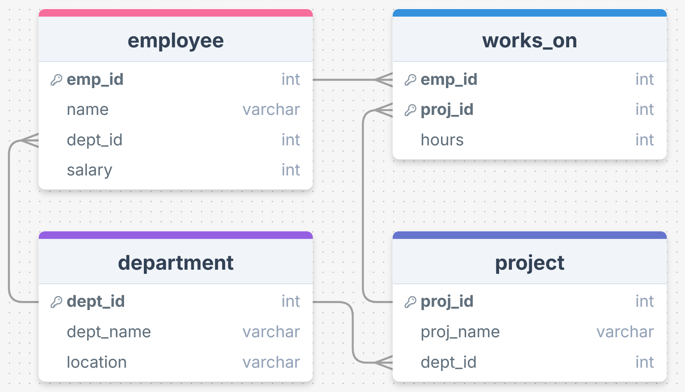

# Class Test 2


## Answer to the Question no. 1

Given schema:

```
Employee(emp_id, name, dept_id, salary)
Department(dept_id, dept_name, location)
Project(proj_id, proj_name, dept_id)
Works_on(emp_id, proj_id, hours)
```

Identifying Primary keys (**PK**) from the schema:

<b>Employee</b>(<ins>emp_id</ins>, name, dept_id, salary)<br>
<b>Department</b>(<ins>dept_id</ins>, dept_name, location)<br>
<b>Project</b>(<ins>proj_id</ins>, proj_name, dept_id)<br>
<b>Works_on</b>(<ins>emp_id, proj_id</ins>, hours)

In the `Works_on` relation, we need a composite primary key (<ins>emp_id, proj_id</ins>) because an employee can work on many projects and a project can have many employees.

Here is the corresponding schema diagram:



## Answer to the Question no. 2

Given schema:

```
Employee(emp_id, name, dept_id, salary)
Department(dept_id, dept_name, location)
Project(proj_id, proj_name, dept_id)
Works_on(emp_id, proj_id, hours)
```

### Q1. Find the name of all employees and their departments located in Dhaka

**SQL:**

```sql
SELECT name, dept_name
FROM employee NATURAL JOIN department
WHERE location = "Dhaka";
```

**Relational Algebra:**

```math
\Large π_{name,\ dept\_ n​ame}​(σ_{location="Dhaka"}​(Employee⋈Department))
```

### Q2. Get the list of employee IDs who work more than 20 hrs per week

**SQL:**

```sql
SELECT DISTINCT emp_id FROM works_on
WHERE hours > 20;
```

**Relational Algebra:**

```math
\Large π_{emp\_ i​d}​(σ_{hours>20}​(Works\_on))
```

### Q3. Retrieve the employee IDs of employees who work in department 10

**SQL:**

```sql
SELECT emp_id FROM employee
WHERE dept_id = 10;
```

**Relational Algebra:**

```math
\Large π_{emp\_ i​d}​(σ_{dept\_ i​d=10}​(Employee))
```

### Q4. Retrieve the names of all employees

**SQL:**

```sql
SELECT name FROM employee;
```

**Relational Algebra:**

```math
\Large π_{name}​(Employee)
```
