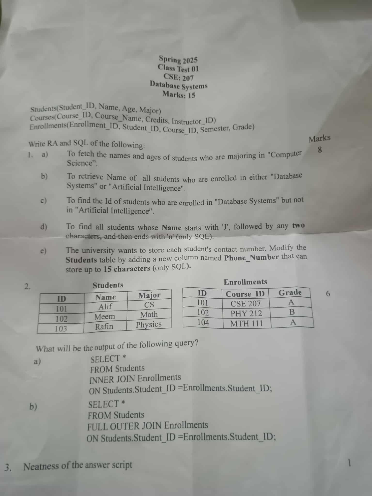

# Class Test 3



## Answer to the Question no. 1

Given schema:

```
Students(Student_ID, Name, Age, Major)
Courses(Course_ID, Course_Name, Credits, Instructor_ID)
Enrollments(Enrollment_ID, Student_ID, Course_ID, Semester, Grade)
```

### a. To fetch the names and ages of students who are majoring in Computer Science

**SQL:**

```sql
SELECT Name, Age FROM Students
WHERE Major="Computer Science";
```

**Relational Algebra:**

```math
\Largeπ_{name,\ age} ​(σ_{major="Computer Science"}​ (Students))
```

### b. To retrieve Name of all students who are enrolled in either DB or AI

**SQL:**

```sql
SELECT DISTINCT Name
FROM Students NATURAL JOIN Courses NATURAL JOIN Enrollments
WHERE Course_Name IN ("DB", "AI");
```

**Relational Algebra:**

```math
\Largeπ_{name} ​(σ_{course\_name="DB"\ ∨\ course\_name="AI"}​ (Students ⋈ Courses ⋈ Enrollments))
```

### c. To find the ID of students who are enrolled in DB but not in AI

**SQL:**

```sql
SELECT DISTINCT Student_ID
FROM Students NATURAL JOIN Courses NATURAL JOIN Enrollments
WHERE Course_Name="DB" AND NOT Course_Name="AI";
```

**Relational Algebra:**

```math
\Largeπ_{name} ​(σ_{course\_name="DB"\ ⋀\ ¬course\_name="AI"}​ (Students ⋈ Courses ⋈ Enrollments))
```

### d. To find all students whose Name starts with `J`, followed by any two characters and then ends with `n` (Only SQL)

**SQL:**

```sql
SELECT Name FROM Students
WHERE Name LIKE "J__n";
```

### e. The university wants to store each student's contact number. Modify the `Students` table by adding a new column named `Phone_Number` that can store up to 15 characters (Only SQL)

**SQL:**

```sql
ALTER TABLE Students
ADD COLUMN Phone_Number VARCHAR(15);
```

## Answer to the Question no. 2

### Query A

```sql
SELECT *
FROM Students INNER JOIN Enrollments
ON Students.ID=Enrollments.ID;
```


### Query B

```sql
SELECT *
FROM Students FULL OUTER JOIN Enrollments
ON Students.ID=Enrollments.ID;
```


