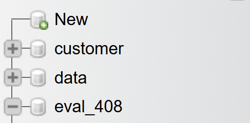
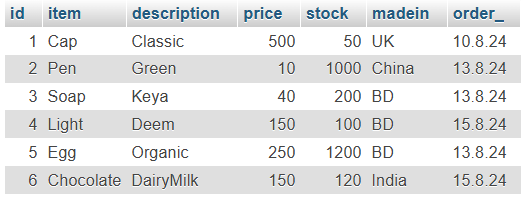

# Lab Evaluation

[**📌 Question Paper**](assets/tasks-set-01.jpg)

## Database Creation

```sql
CREATE DATABASE eval_408;
```



## Table Creation

```sql
CREATE TABLE product (id int(3), item varchar(32), description varchar(32), price int(8), stock int(5), madein varchar(16), order_ varchar(16));
```


## Data Insertion

```sql
INSERT INTO product VALUES(1, "Cap", "Classic", 500, 50, "UK", "10.8.24");
INSERT INTO product VALUES(2, "Pen", "Green", 10, 1000, "China", "13.8.24");
INSERT INTO product VALUES(3, "Soap", "Keya", 40, 200, "BD", "13.8.24");
INSERT INTO product VALUES(4, "Light", "Deem", 150, 100, "BD", "15.8.24");
INSERT INTO product VALUES(5, "Egg", "Organic", 250, 1200, "BD", "13.8.24");
INSERT INTO product VALUES(6, "Chocolate", "DairyMilk", 150, 120, "India", "15.8.24");
```



# Lab Tasks

## 1. Find the total number of products made in BD

```sql
SELECT Count(*) "Total number of products" FROM product WHERE madein="BD";
```


## 2. Which product has the maximum stock?

```sql
SELECT * FROM product WHERE stock=(SELECT Max(stock) FROM product);
```


## 3. Which products have prices greater than the average price of all products?

```sql
SELECT * FROM product WHERE price > (SELECT Avg(price) FROM product);
```


## 4. Change the description of pen from Green to Red

```sql
UPDATE product SET description="Red" WHERE item="Pen";
```


## 5. Increase the price of each product by 5%

```sql
UPDATE product SET price=(price * (1 + 0.05));
```


## 6. Find the products order on the 13th of August

```sql
SELECT * FROM product WHERE order_="13.8.24";
```


## 7. Find the product name which has consecutive two `g`

```sql
SELECT item from product WHERE item LIKE "%gg";
```


