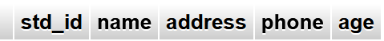

# Lab Evaluation

[**📌 Question Paper**](assets/tasks-set-02.jpg)

## Database Creation

```sql
CREATE DATABASE eval_408;
```


## Table Creation

```sql
CREATE TABLE student(std_id int(2), name char(2), address varchar(8), phone char(10), age float(4.2));
```



## Data Insertion

```sql
INSERT INTO student VALUES(1, "Ab", "Dhaka", "12346478", 20.00);
INSERT INTO student VALUES(2, "Ac", "Shylet", "11233573", 21.00);
INSERT INTO student VALUES(3, "Ad", "Rangpur", "12351343", 22.00);
INSERT INTO student VALUES(4, "Ae", "Siraganj", "23455967", 23.00);
INSERT INTO student VALUES(5, "Af", "Pabna", "34561233", 21.00);
```


# Lab Tasks

## 1. Find the total number of students (column name should be "Total number of students")

```sql
SELECT Count(*) "Total number of students" FROM student;
```


## 2. Find the last 3 digits from the contact number for each student

```sql
SELECT Right(phone, 3) "Last Three Digits" FROM student;
```


## 3. Find the ID and age of those students which has an age greater than the average age of all students

```sql
SELECT std_id, age FROM student WHERE age > (SELECT Avg(age) FROM student);
```


## 4. Find the name of the student the highest age

```sql
SELECT name FROM student WHERE age=(SELECT Max(age) FROM student);
```


## 5. Find the ID of those students whose address has `a` in 2nd position and `g` in 4th position

```sql
SELECT std_id FROM student WHERE address LIKE "_a_g%";
```


## 6. Increase the age of each student by 2%

```sql
UPDATE student
SET age=(age * (1 + 2/100));
```


