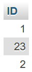

# First Lab

## General Formulas

To create a new database:

```sql
CREATE DATABASE DB_Name;
```

To create a new table:

```sql
CREATE TABLE T_NAME (COL_NAME DATA_TYPE(SIZE), ...);
```

To insert a new row:

```sql
INSERT INTO T_NAME VALUES(val1, val2, ...);
```

To delete an existing column:

```sql
ALTER TABLE T_NAME DROP COLUMN COL_NAME;
```

# Lab Tasks

## 1. Creation of Databases

Create a database named `shahriar_408`.

```sql
CREATE DATABASE shahriar_408;
```


## 2A. Creation of Tables

Create three tables in this database named `student`, `faculty`, and `course`.


```sql
CREATE TABLE student (Name varchar(32), ID int(8), NID int(9), Intake int(2), Section int(2), CGPA float(3.2));
```


```sql
CREATE TABLE faculty (Name varchar(32), Short_Code char(4), Course_Code char(8), Conduct_Semester varchar(16));
```


```sql
CREATE TABLE course (Course_Title varchar(32), Course_Code char(8));
```


## 2B. Data Insertion

Add data to these three tables.

### Student

```sql
INSERT INTO student VALUES("Ashraful", 1, 102, 44, 1, 3.30);
INSERT INTO student VALUES("Tonny", 2, 101, 44, 1, 3.50);
INSERT INTO student VALUES("Zakir", 33, 103, 35, 2, 3.98);
INSERT INTO student VALUES("Urmi", 6, 104, 35, 1, 3.96);
INSERT INTO student VALUES("Minu", 23, 105, 44, 1, 3.50);
```


### Faculty

```sql
INSERT INTO faculty VALUES("Farha Akhter Munmun", "FAM", "CSE 319", "Summer 2019");
INSERT INTO faculty VALUES("Sweety Lima", "SWL", "CSE 209", "Fall 2019-20");
INSERT INTO faculty VALUES("Shumi Khatun", "SKL", NULL, "Summer 2019");
INSERT INTO faculty VALUES("Nadia Afrin Ritu", NULL, "CSE 351", NULL);
```


### Course

```sql
INSERT INTO course VALUES("Database Systems", "CSE 207");
INSERT INTO course VALUES("Computer Networks", "CSE 319");
INSERT INTO course VALUES("Data Communication", "CSE 209");
INSERT INTO course VALUES("System Analysis Design", NULL);
```


## 3. Query Operations

### a. Update the `NULL` Short Code

```sql
UPDATE faculty SET Short_Code="NAR" WHERE Name="Nadia Afrin Ritu";
```


### b. Update the `NULL` Course Code

```sql
UPDATE faculty SET Course_Code="CSE 212" WHERE Name="Shumi Khatun";
```


### c. Update the `NULL` Conduct Semester

```sql
UPDATE faculty SET Conduct_Semester="Spring 2026" WHERE Name="Nadia Afrin Ritu";
```


### d. Add a new column `Age` in the `student` table

```sql
ALTER TABLE student
ADD Age int(5);
```


### e. Update the age of each student

```sql
UPDATE student SET Age=21 WHERE ID=1;
UPDATE student SET Age=22 WHERE ID=2;
UPDATE student SET Age=19 WHERE ID=33;
UPDATE student SET Age=21 WHERE ID=6;
UPDATE student SET Age=19 WHERE ID=23;
```


### f. Find the names of all courses in the `course` table

```sql
SELECT Course_Title FROM course;
```


### g. Find the names of all teachers who have conducted in summer 2019

```sql
SELECT Name FROM faculty WHERE Conduct_Semester="Summer 2019";
SELECT Name, Short_Code FROM faculty WHERE Conduct_Semester="Summer 2019";
```


### h. Find the names of all students whose CGPA is greater than 3.50

```sql
SELECT Name FROM Student WHERE CGPA > 3.50;
```


### i. Add a new column `Offered Semester` after the column `Course Title`

```sql
ALTER table course
ADD column Offered_Semester varchar(32) AFTER Course_Title;
```


### j. Find the name and CGPA of each student and order them by CGPA

```sql
SELECT Name, CGPA FROM student ORDER BY CGPA DESC;
SELECT Name, CGPA FROM student ORDER BY CGPA ASC;
```


### k. Find the name of all students whose age is greater than 19 and CGPA is greater than 3.50

```sql
SELECT Name FROM Student WHERE Age > 19 AND CGPA > 3.50;
```


### l. Find the ID of all those students who are from 44 intake or have CGPA less than 3.40

```sql
SELECT ID FROM Student WHERE Intake = 44 OR CGPA < 3.4;
```



### m. Find the ID of all those students whose CGPA is either 3.50, 3.60, or 3.96

```sql
SELECT ID FROM Student WHERE CGPA IN(3.5, 3.6, 3.96);
SELECT ID FROM Student WHERE CGPA NOT IN(3.5, 3.6, 3.96);
```


