::: {#cover.border}

<section>
	
</section>
<section>
	<p class="h1 w800 underline text-upr">Lab Report</p>
	<table class="compact borderless table-large table-upr padless" style="width: 5.1in">
		<tr>
			<th>Course Title</th>
			<th>:</th><td>Database Systems Lab</td>
		</tr>
		<tr>
			<th>Course Code</th>
			<th>:</th><td>CSE 208</td>
		</tr>
		<tr>
			<th>Lab Report No.</th>
			<th>:</th><td>02</td>
		</tr>
		<tr>
			<th>Submission Date</th>
			<th>:</th><td>06-08-2025</td>
		</tr>
	</table>
</section>
<section style="--hw: 7.2rem;">
	<p class="h2 w800 text-upr">Submitted To</p>
	<table class="compact borderless table-large table-upr padless withleader">
		<tr>
			<th>Name</th>
			<td>Farha Akhter Munmun</td>
		</tr>
		<tr>
			<th>Dept. of</th>
			<td>Computer Science and Engineering (CSE)</td>
		</tr>
		<tr>
			<th></th>
			<td>Bangladesh University of Business & Technology (BUBT)</td>
		</tr>
	</table>
</section>
<section style="--hw: 7.2rem;">
	<p class="h2 w800 text-upr">Submitted By</p>
	<table class="compact borderless table-large table-upr padless withleader">
		<tr>
			<th>Name</th>
			<td>Shadman Shahriar</td>
		</tr>
		<tr>
			<th>ID No.</th>
			<td>20245103408</td>
		</tr>
		<tr>
			<th>Intake</th>
			<td>53</td>
		</tr>
		<tr>
			<th>Section</th>
			<td>1</td>
		</tr>
		<tr>
			<th>Program</th>
			<td>B.Sc. Engg. in CSE</td>
		</tr>
	</table>
</section>

:::

::: {.centered-heading}

# Database Systems Lab

:::

## Prerequisite

Creating a new database:

```sql
CREATE DATABASE bank_408;
```

Creating six tables: `account`, `branch`, `depositor`, `customer`, `loan` and `borrower`

```sql
CREATE TABLE account (account_number char(5), branch_name varchar(32), balance int(7));
CREATE TABLE branch (branch_name varchar(32), branch_city varchar(32), assets int(8));
CREATE TABLE depositor (customer_name varchar(32), account_number char(5));
CREATE TABLE customer (customer_name varchar(32), customer_street varchar(32), customer_city varchar(32));
CREATE TABLE loan (loan_number char(5), branch_name varchar(32), amount int(8));
CREATE TABLE borrower (customer_name varchar(32), loan_number char(8));
```

Inserting data to the tables:

```sql
-- Inserting data into `account`
INSERT INTO account VALUES("A-101", "Downtown", 500);
INSERT INTO account VALUES("A-102", "Perryridge", 400);
INSERT INTO account VALUES("A-201", "Brighton", 900);
INSERT INTO account VALUES("A-215", "Mianus", 700);
INSERT INTO account VALUES("A-217", "Brighton", 750);
INSERT INTO account VALUES("A-222", "Redwood", 700);
INSERT INTO account VALUES("A-305", "Round Hill", 350);

-- Inserting data into `branch`
INSERT INTO branch VALUES("Brighton", "Brooklyn", 7100000);
INSERT INTO branch VALUES("Downtown", "Brooklyn", 9000000);
INSERT INTO branch VALUES("Mianus", "Horseneck", 400000);
INSERT INTO branch VALUES("North Town", "Rye", 3700000);
INSERT INTO branch VALUES("Perryridge", "Horseneck", 1700000);
INSERT INTO branch VALUES("Pownal", "Bennington", 300000);
INSERT INTO branch VALUES("Redwood", "Palo Alto", 2100000);
INSERT INTO branch VALUES("Round Hill", "Horseneck", 8000000);

-- Inserting data into `depositor`
INSERT INTO depositor VALUES("Hayes", "A-102");
INSERT INTO depositor VALUES("Johnson", "A-101");
INSERT INTO depositor VALUES("Johnson", "A-201");
INSERT INTO depositor VALUES("Jones", "A-217");
INSERT INTO depositor VALUES("Lindsay", "A-222");
INSERT INTO depositor VALUES("Smith", "A-215");
INSERT INTO depositor VALUES("Turner", "A-305");

-- Inserting data into `customer`
INSERT INTO customer VALUES("Adams", "Spring", "Pittsfield");
INSERT INTO customer VALUES("Brooks", "Senator", "Brooklyn");
INSERT INTO customer VALUES("Curry", "North", "Rye");
INSERT INTO customer VALUES("Glenn", "Sand Hill", "Woodside");
INSERT INTO customer VALUES("Green", "Walnut", "Stamford");
INSERT INTO customer VALUES("Hayes", "Main", "Harrison");
INSERT INTO customer VALUES("Johnson", "Alma", "Palo Alto");
INSERT INTO customer VALUES("Jones", "Main", "Harrison");
INSERT INTO customer VALUES("Lindsay", "Park", "Pittsfield");
INSERT INTO customer VALUES("Smith", "North", "Rye");
INSERT INTO customer VALUES("Turner", "Putnam", "Stamford");
INSERT INTO customer VALUES("Williams", "Nassau", "Princeton");

-- Inserting data into `loan`
INSERT INTO loan VALUES("L-11", "Round Hill", 900);
INSERT INTO loan VALUES("L-14", "Downtown", 1500);
INSERT INTO loan VALUES("L-15", "Perryridge", 1500);
INSERT INTO loan VALUES("L-16", "Perryridge", 1300);
INSERT INTO loan VALUES("L-17", "Downtown", 1000);
INSERT INTO loan VALUES("L-23", "Redwoord", 2000);
INSERT INTO loan VALUES("L-93", "Mianus", 500);

-- Inserting data into `borrower`
INSERT INTO borrower VALUES("Adams", "L-16");
INSERT INTO borrower VALUES("Curry", "L-93");
INSERT INTO borrower VALUES("Hayes", "L-15");
INSERT INTO borrower VALUES("Johnson", "L-14");
INSERT INTO borrower VALUES("Jones", "L-17");
INSERT INTO borrower VALUES("Smith", "L-11");
INSERT INTO borrower VALUES("Smith", "L-23");
INSERT INTO borrower VALUES("Williams", "L-17");
```

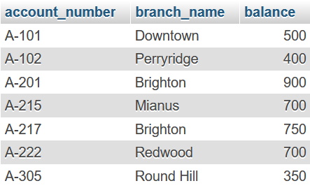

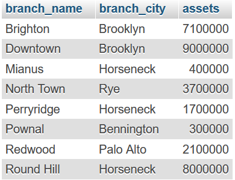

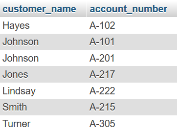

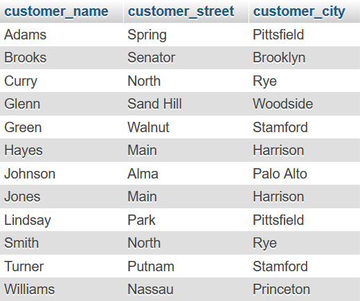

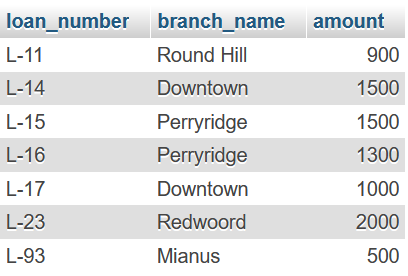

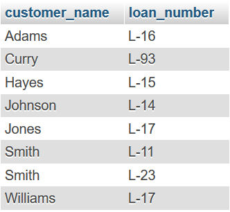

## Lab Tasks

### 1. Find the names of all branches in the `loan` relation

```sql
SELECT branch_name FROM loan;
```

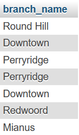

### 2. Find all loan numbers for loans made at the `Perryridge` branch with loan amounts greater than 300

```sql
SELECT loan_number FROM loan WHERE branch_name="Perryridge" AND amount > 300;
```

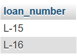

### 3. Find all the loan numbers of the customers who has loan either `Perryridge` branch or `Downtown` branch

```sql
SELECT loan_number FROM loan WHERE branch_name IN("Perryridge", "Downtown");
```

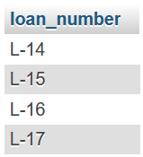

### 4. Find all the loan numbers of the customers who has loan either `Perryridge` branch or `Downtown` branch or `Mianus` branch

```sql
SELECT loan_number FROM loan WHERE branch_name IN("Perryridge", "Downtown", "Mianus");
```

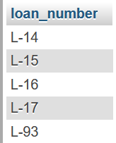

### 5. Find the names of all customers who are not from `Stamford` or `Princeton` or `Harrison` city

```sql
SELECT customer_name FROM customer WHERE customer_city NOT IN("Stamford", "Princeton", "Harrison");
```

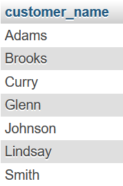

### 6. Find the largest, minimum, and average account balance in the `account` relation

```sql
SELECT Max(balance), Min(balance), Avg(balance) FROM account;
```

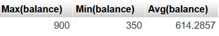

### 7. Find the total number of customer from `customer` relation

```sql
SELECT Count(customer_name) FROM customer;
```

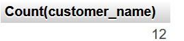

### 8. Find the loan number of those loans with loan amounts between 400 and 800

```sql
SELECT loan_number FROM loan WHERE amount > 400 AND amount < 800;
```

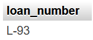

### 9. Find the names of all customers whose name start with `G`

```sql
SELECT customer_name FROM customer WHERE customer_name LIKE "G%";
```

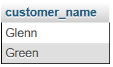

### 10. Find the names of all customers whose name ends with `s`

```sql
SELECT customer_name FROM customer WHERE customer_name LIKE "%s";
```

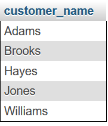

### 11. Find the names of all customers whose name has a `o` in 2nd position

```sql
SELECT customer_name FROM customer WHERE customer_name LIKE "_o%";
```

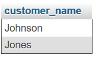

### 12. Find the names of all customers whose name has a `o` in any position except 1st and last letter

```sql
SELECT customer_name FROM customer WHERE customer_name LIKE "%o%";
```

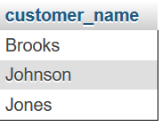

### 13. Find the length of the name of all customers from `Customer` relation

```sql
SELECT customer_name, Length(customer_name) FROM customer;
```


### 14. Find 1st three characters of each customer name from `customer` relation

```sql
SELECT customer_name, SUBSTR(customer_name, 1, 3) FROM customer;
```

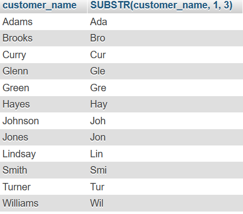
