# Third Lab

> [!IMPORTANT]
> This is a continuation of the topics discussed in the second lab. So, it inherits the six data tables from the [**previous lab**](https://github.com/ShadowShahriar/cse208/tree/main/lab-reports/02-2025-07-30).

## Prerequisite

### 1. Primary Key Definition

> [!NOTE]
> A table can only contain **one primary key**. The column that has unique values can become the primary key.

Primary key **while** table creation:

```sql
CREATE TABLE customer(customer_name varchar(30) PRIMARY KEY, c_street varchar(20), c_city varchar(30));
```

Primary key **after** table creation:

```sql
ALTER TABLE customer ADD PRIMARY KEY(customer_name);
```

### 2. Composite Primary Key Definition

> [!NOTE]
> When we construct a primary key using multiple columns, it is referred to as a **Composite Primary Key**. This is demonstrated in the `borrower` table.

Composite primary key **while** table creation:

```sql
CREATE TABLE borrower(customer_name varchar(30), loan_number varchar(10), PRIMARY KEY(customer_name, loan_number));
```

Composite primary key **after** table creation:

```sql
ALTER TABLE customer ADD PRIMARY KEY(customer_name, loan_number);
```

### 3. Primary Key Definition of Multiple Tables

Definition of Primary Key in the given six tables:

```sql
ALTER TABLE account ADD PRIMARY KEY(account_number);
ALTER TABLE branch ADD PRIMARY KEY(branch_name);
ALTER TABLE depositor ADD PRIMARY KEY(customer_name, account_number);
ALTER TABLE customer ADD PRIMARY KEY(customer_name);
ALTER TABLE loan ADD PRIMARY KEY(loan_number);
ALTER TABLE borrower ADD PRIMARY KEY(customer_name, loan_number);
```

<p align="center">
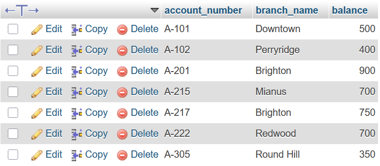

<br>

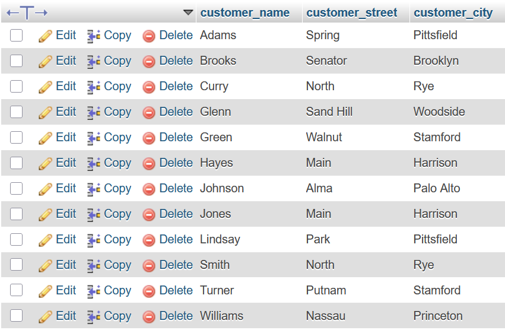
<br>


</p>

# Lab Tasks

## 1. Find the names of all branches in the `loan` relation

```sql
SELECT DISTINCT branch_name FROM loan;
```

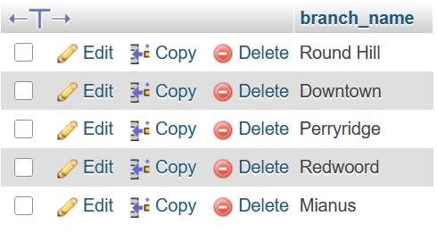

## 2. Find all loan numbers for loans made at the `Perryridge` branch with loan amounts greater than 300

```sql
SELECT loan_number FROM loan WHERE branch_name="Perryridge" AND amount > 300;
```

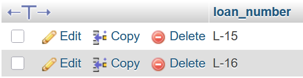

## 3. Find all the loan numbers of the customers who has loan either `Perryridge` branch or `Downtown` branch

```sql
SELECT loan_number FROM loan WHERE branch_name IN("Perryridge", "Downtown");
```

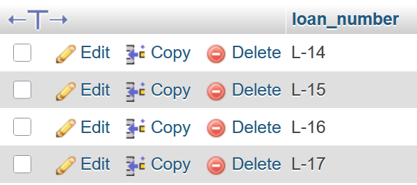

## 4. Find all the loan numbers of the customers who has loan either `Perryridge` branch or `Downtown` branch or `Mianus` branch

```sql
SELECT loan_number FROM loan WHERE branch_name IN("Perryridge", "Downtown", "Mianus");
```

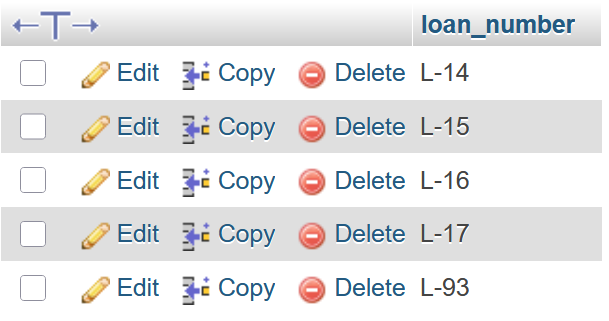

## 5. Find the names of all customers who are not from `Stamford` or `Princeton` or `Harrison` city

```sql
SELECT customer_name FROM customer WHERE customer_city NOT IN("Stamford", "Princeton", "Harrison");
```

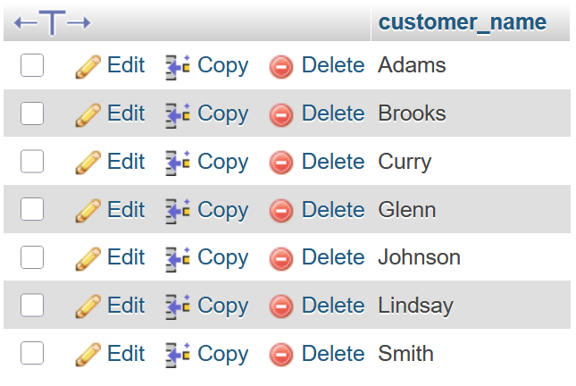

## 6. Find the largest, minimum, and average account balance in the `account` relation

```sql
SELECT Max(balance) "Maximum", Min(balance) "Minimum", Avg(balance) "Average" FROM account;
```

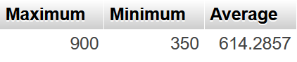

## 7. Find the total number of customer from `customer` relation

```sql
SELECT Count(customer_name) "Total no. of Customers" FROM customer;
```

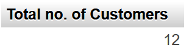

## 8. Find the loan number of those loans with loan amounts between 400 and 800 (inclusive)

```sql
SELECT loan_number FROM loan WHERE amount >= 400 AND amount <= 800;
```

Alternative approach:

```sql
SELECT loan_number FROM loan WHERE amount BETWEEN 400 AND 800;
```


## 9. Find the names of all customers whose name start with `G`

```sql
SELECT customer_name FROM customer WHERE customer_name LIKE "G%";
```

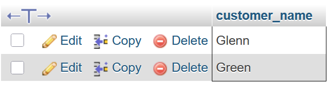

## 10. Find the names of all customers whose name ends with `s`

```sql
SELECT customer_name FROM customer WHERE customer_name LIKE "%s";
```

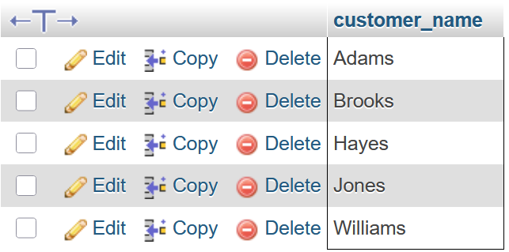

## 11. Find the names of all customers whose name has a `o` in 2nd position

```sql
SELECT customer_name FROM customer WHERE customer_name LIKE "_o%";
```

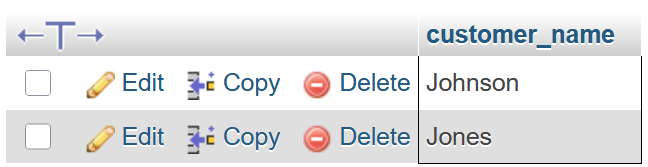

## 12. Find the names of all customers whose name has a `o` in any position except 1st and last letter

```sql
SELECT customer_name FROM customer WHERE customer_name LIKE "%o%";
```


## 13. Find the length of the name of all customers from `customer` relation

```sql
SELECT customer_name, Length(customer_name) "Length" FROM customer;
```

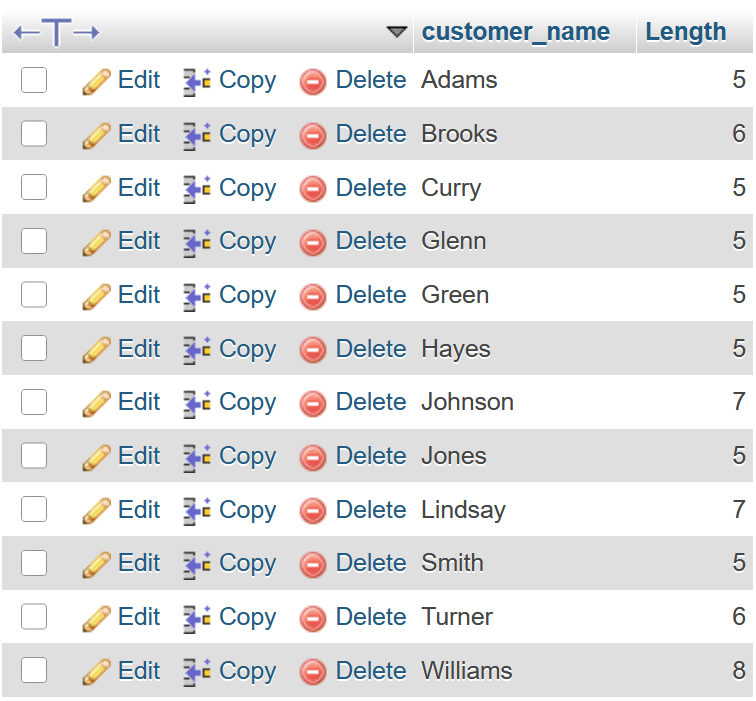

## 14. Find 1st three characters of each customer name from `customer` relation

```sql
SELECT customer_name, SUBSTR(customer_name, 1, 3) "Name Initials" FROM customer;
```

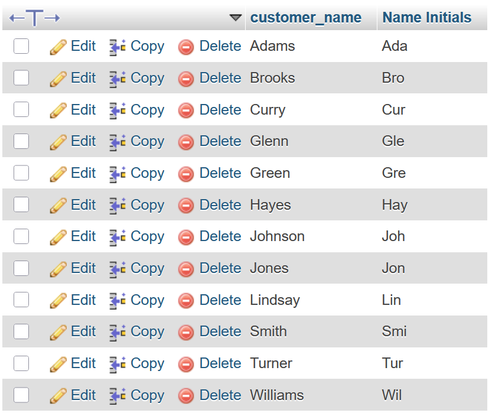

`SUBSTR` function definition:

```
SUBSTR(column_name, start_position, length_of_substring)
```

> [!NOTE]
> The `start_position` is 1 based.
