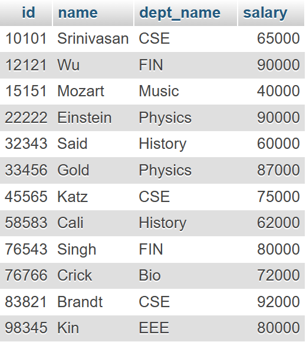
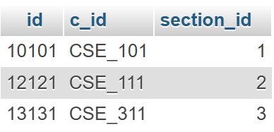
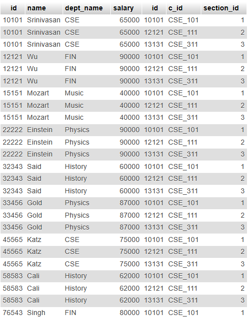
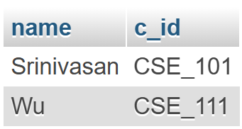
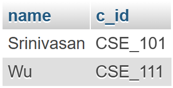
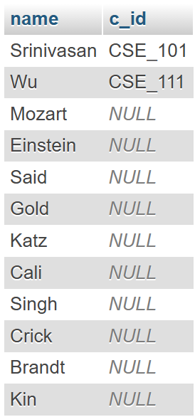
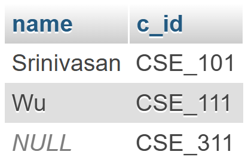

# Fifth Lab

## Prerequisite

Creating a new database:

```sql
CREATE DATABASE faculty;
```

<p align="center">

</p>

Creating two tables: `instructor` and `teaches`

```sql
CREATE TABLE instructor(id int(8), name varchar(12), dept_name varchar(12), salary int(6));
CREATE TABLE teaches(id int(8), c_id char(8), section_id int(2));
```

<p align="center">

<br>

</p>

Inserting data to the tables:

```sql
-- inserting data into `instructor`
INSERT INTO instructor VALUES(10101, "Srinivasan", "CSE", 65000);
INSERT INTO instructor VALUES(12121, "Wu", "FIN", 90000);
INSERT INTO instructor VALUES(15151, "Mozart", "Music", 40000);
INSERT INTO instructor VALUES(22222, "Einstein", "Physics", 90000);
INSERT INTO instructor VALUES(32343, "Said", "History", 60000);
INSERT INTO instructor VALUES(33456, "Gold", "Physics", 87000);
INSERT INTO instructor VALUES(45565, "Katz", "CSE", 75000);
INSERT INTO instructor VALUES(58583, "Cali", "History", 62000);
INSERT INTO instructor VALUES(76543, "Singh", "FIN", 80000);
INSERT INTO instructor VALUES(76766, "Crick", "Bio", 72000);
INSERT INTO instructor VALUES(83821, "Brandt", "CSE", 92000);
INSERT INTO instructor VALUES(98345, "Kin", "EEE", 80000);

-- inserting data into `teaches`
INSERT INTO teaches VALUES(10101, "CSE_101", 1);
INSERT INTO teaches VALUES(12121, "CSE_111", 2);
INSERT INTO teaches VALUES(13131, "CSE_311", 3);
```

<p align="center">

<br>

</p>

# Lab Tasks

## 1. Perform Cartesian Product operation between these two relations

```sql
SELECT * FROM instructor, teaches;
```

Alternative approach:

```sql
SELECT * FROM instructor CROSS JOIN teaches;
```



## 2. Find those instructors who teach any of the courses

```sql
SELECT name, c_id FROM instructor INNER JOIN teaches WHERE Instructor.ID=teaches.ID;
```



## 3. Find only instructor names and course id for instructors in the Computer Science department

```sql
SELECT name, c_id FROM instructor INNER JOIN teaches WHERE Instructor.ID=teaches.ID AND dept_name="CSE";
```

Done using **Natural Join**:

```sql
SELECT name, c_id FROM instructor NATURAL JOIN teaches WHERE dept_name="CSE";
```


## 4. Find the total no. of tuples in the `instructor` relation

```sql
SELECT Count(*) FROM instructor;
```


## 5. Redo task 2 using natural join

```sql
SELECT name, c_id FROM instructor NATURAL JOIN teaches;
```



## 6. Perform left outer join

```sql
SELECT name, c_id FROM instructor NATURAL LEFT OUTER JOIN teaches;
```



## 7. Perform right outer join

```sql
SELECT name, c_id FROM instructor NATURAL RIGHT OUTER JOIN teaches;
```


