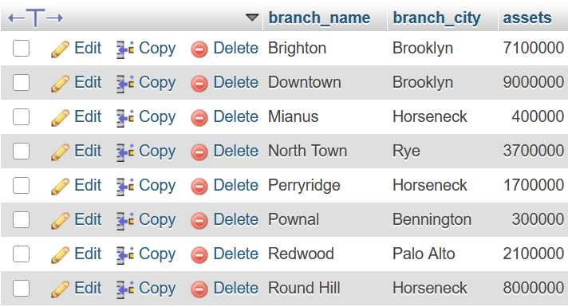
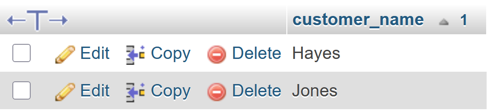
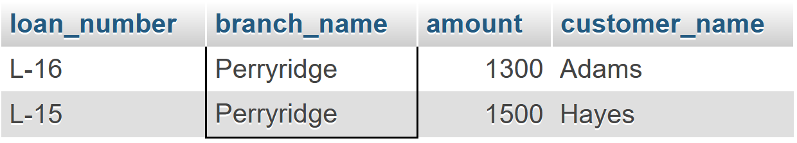
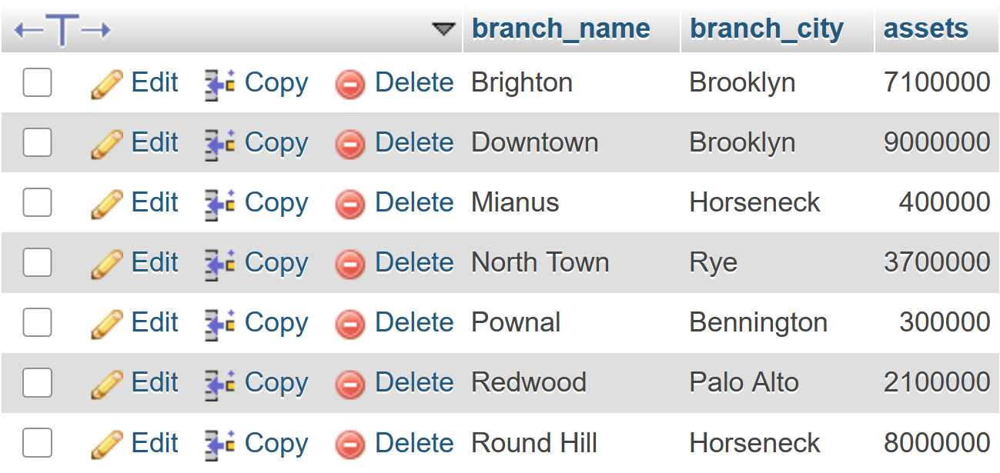

# Sixth Lab

> [!IMPORTANT]
> This is a continuation of the topics discussed in the previous labs. So, it inherits the six data tables from the [**second lab**](https://github.com/ShadowShahriar/cse208/tree/main/lab-reports/02-2025-07-30) and primary keys from the [**third lab**](https://github.com/ShadowShahriar/cse208/tree/main/lab-reports/03-2025-08-06).

<p align="center">


<br>


<br>


</p>

# Lab Tasks

## 1. Fetch all the customer's name in alphabetic order who lives in `Harrison`

```sql
SELECT customer_name FROM customer
WHERE customer_city="Harrison"
ORDER BY customer_name;
```



## 2. Find the list of all customers in alphabetic order who have a loan at the `Perryridge` branch

```sql
SELECT * FROM loan, borrower
WHERE loan.loan_number=borrower.loan_number
AND branch_name="Perryridge";
```


Alternative approach:

```sql
SELECT * FROM loan NATURAL JOIN borrower
WHERE branch_name="Perryridge";
```



## 3. Find all customers who have a loan from the bank, find their names, loan numbers and loan amount

```sql
SELECT customer_name, loan.loan_number, amount
FROM loan, borrower
WHERE borrower.loan_number=loan.loan_number;
```


## 4. Find the name of all branches from `loan` table

```sql
SELECT DISTINCT branch_name FROM loan;
```


## 5. Find loan number and 5 times amount from `loan` relation and replace the column name with `Total Balance`

```sql
SELECT loan_number, amount*5 "Total Balance" FROM loan;
```


## 6. Increase all loan amount by 5 percent from `loan` relation

```sql
SELECT loan_number, amount*1.05 FROM loan;
```


## 7. Give 6 percent interest for all loans with amount over `1000`

```sql
SELECT loan_number, amount*1.06 FROM loan
WHERE amount > 1000;
```


## 8. Delete all information of Perryridge branch from `branch` table

```sql
DELETE FROM branch
WHERE branch_name="Perryridge";
```




## 9. Delete all loans with loan amounts between `1300` and `1500`

```sql
DELETE FROM loan
WHERE amount >= 1300 AND amount <= 1500;
```


