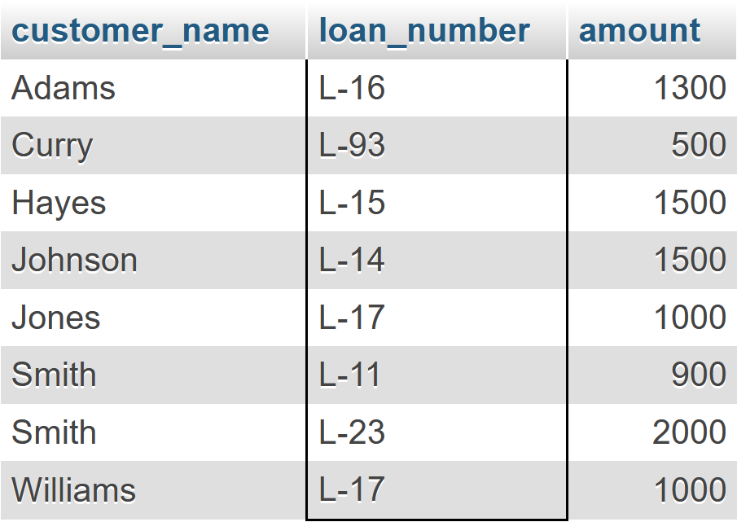

::: {#cover.border}

<section>
	
</section>
<section>
	<p class="h1 w800 underline text-upr">Lab Report</p>
	<table class="compact borderless table-large table-upr padless" style="width: 5.1in">
		<tr>
			<th>Course Title</th>
			<th>:</th><td>Database Systems Lab</td>
		</tr>
		<tr>
			<th>Course Code</th>
			<th>:</th><td>CSE 208</td>
		</tr>
		<tr>
			<th>Lab Report No.</th>
			<th>:</th><td>05</td>
		</tr>
		<tr>
			<th>Submission Date</th>
			<th>:</th><td>03-09-2025</td>
		</tr>
	</table>
</section>
<section style="--hw: 7.2rem;">
	<p class="h2 w800 text-upr">Submitted To</p>
	<table class="compact borderless table-large table-upr padless withleader">
		<tr>
			<th>Name</th>
			<td>Farha Akhter Munmun</td>
		</tr>
		<tr>
			<th>Dept. of</th>
			<td>Computer Science and Engineering (CSE)</td>
		</tr>
		<tr>
			<th></th>
			<td>Bangladesh University of Business & Technology (BUBT)</td>
		</tr>
	</table>
</section>
<section style="--hw: 7.2rem;">
	<p class="h2 w800 text-upr">Submitted By</p>
	<table class="compact borderless table-large table-upr padless withleader">
		<tr>
			<th>Name</th>
			<td>Shadman Shahriar</td>
		</tr>
		<tr>
			<th>ID No.</th>
			<td>20245103408</td>
		</tr>
		<tr>
			<th>Intake</th>
			<td>53</td>
		</tr>
		<tr>
			<th>Section</th>
			<td>1</td>
		</tr>
		<tr>
			<th>Program</th>
			<td>B.Sc. Engg. in CSE</td>
		</tr>
	</table>
</section>

:::

::: {.centered-heading}

# Database Systems Lab

:::

This is a continuation of the topics discussed in the previous labs. It inherits the six data tables from the **2nd lab** and primary keys from the **3rd lab**.

<!-- <p align="center">


</p> -->


# Lab Tasks

## 1. Fetch all the customer's name in alphabetic order who lives in `Harrison`

```sql
SELECT customer_name FROM customer
WHERE customer_city="Harrison"
ORDER BY customer_name;
```


## 2. Find the list of all customers in alphabetic order who have a loan at the `Perryridge` branch

```sql
SELECT * FROM loan, borrower
WHERE loan.loan_number=borrower.loan_number
AND branch_name="Perryridge";
```


Alternative approach:

```sql
SELECT * FROM loan NATURAL JOIN borrower
WHERE branch_name="Perryridge";
```


## 3. Find all customers who have a loan from the bank, find their names, loan numbers and loan amount

```sql
SELECT customer_name, loan.loan_number, amount
FROM loan, borrower
WHERE borrower.loan_number=loan.loan_number;
```



## 4. Find the name of all branches from `loan` table

```sql
SELECT DISTINCT branch_name FROM loan;
```


## 5. Find loan number and 5 times amount from `loan` relation and replace the column name with `Total Balance`

```sql
SELECT loan_number, amount*5 "Total Balance" FROM loan;
```


## 6. Increase all loan amount by 5 percent from `loan` relation

```sql
SELECT loan_number, amount*1.05 FROM loan;
```


## 7. Give 6 percent interest for all loans with amount over `1000`

```sql
SELECT loan_number, amount*1.06 FROM loan
WHERE amount > 1000;
```


## 8. Delete all information of Perryridge branch from `branch` table

```sql
DELETE FROM branch WHERE branch_name="Perryridge";
```


## 9. Delete all loans with loan amounts between `1300` and `1500`

```sql
DELETE FROM loan
WHERE amount >= 1300 AND amount <= 1500;
```


