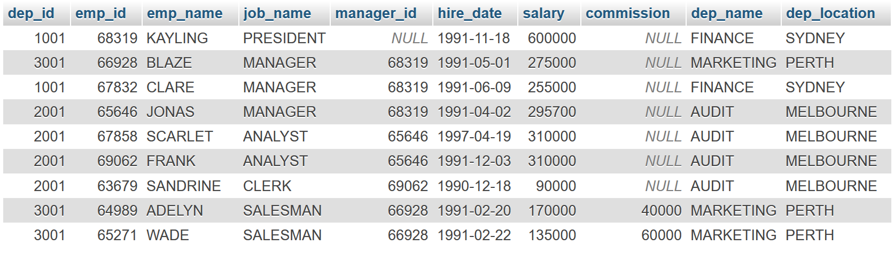

# Seventh Lab

## Prerequisite

Create a database named **company**:

```sql
CREATE DATABASE company;
```

Create two tables: `employee` and `department`:

```sql
CREATE TABLE employee(emp_id int(6), emp_name varchar(12), job_name varchar(16), manager_id int(6), hire_date varchar(12), salary int(8), commission int(8), dep_id int(4));
CREATE TABLE department(dep_id int(4), dep_name varchar(16), dep_location varchar(24));
```

Inserting data into the tables:

```sql
-- Inserting data into `employee`
INSERT INTO employee VALUES(68319, "KAYLING", "PRESIDENT", NULL, "1991-11-18", 600000, NULL, 1001);
INSERT INTO employee VALUES(66928, "BLAZE", "MANAGER", 68319, "1991-05-01", 275000, NULL, 3001);
INSERT INTO employee VALUES(67832, "CLARE", "MANAGER", 68319, "1991-06-09", 255000, NULL, 1001);
INSERT INTO employee VALUES(65646, "JONAS", "MANAGER", 68319, "1991-04-02", 295700, NULL, 2001);
INSERT INTO employee VALUES(67858, "SCARLET", "ANALYST", 65646, "1997-04-19", 310000, NULL, 2001);
INSERT INTO employee VALUES(69062, "FRANK", "ANALYST", 65646, "1991-12-03", 310000, NULL, 2001);
INSERT INTO employee VALUES(63679, "SANDRINE", "CLERK", 69062, "1990-12-18", 90000, NULL, 2001);
INSERT INTO employee VALUES(64989, "ADELYN", "SALESMAN", 66928, "1991-02-20", 170000, 40000, 3001);
INSERT INTO employee VALUES(65271, "WADE", "SALESMAN", 66928, "1991-02-22", 135000, 60000, 3001);

-- Inserting data into `department`
INSERT INTO department VALUES(1001, "FINANCE", "SYDNEY");
INSERT INTO department VALUES(2001, "AUDIT", "MELBOURNE");
INSERT INTO department VALUES(3001, "MARKETING", "PERTH");
INSERT INTO department VALUES(4001, "PRODUCTION", "BRISBANE");
```

<p align="center">


</p>

# Lab Tasks

## Employee Details

From the following table, write a SQL query to find **employees** along with their **department details**.

Return `employee ID`, `employee name`, `job name`, `manager ID`, `hire date`, `salary`, `commission`, `department ID`, and `department name`.

```sql
SELECT * FROM employee NATURAL JOIN department;
```



## Well Paid Employees

From the following table, write a SQL query to identify those employees who earn **60000 or more** per year _or_ **DO NOT work as ANALYST**.

```sql
SELECT * FROM employee
WHERE salary >= 60000 OR job_name != "ANALYST";
```


## Third Highest Paid

Find the **third highest salary** of the employee.

```sql
SELECT salary FROM employee
ORDER BY salary DESC LIMIT 2, 1
```


> [!NOTE]
> The `LIMIT` clause is used to specify the number of records to return.
>
> ```sql
> SELECT COL_NAME, ...
> FROM T_NAME
> LIMIT OFFSET, ROW_COUNT;
> ```
>
> `OFFSET` starts from 0 and `ROW_COUNT` starts from 1.
