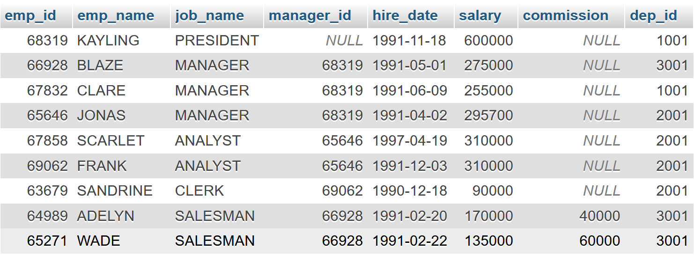
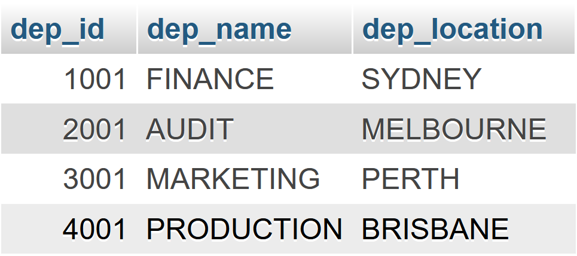
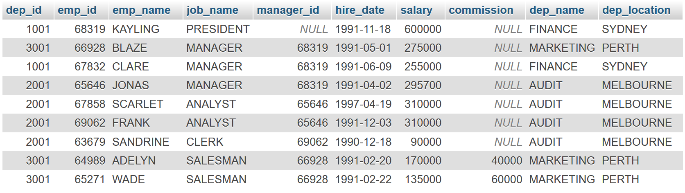
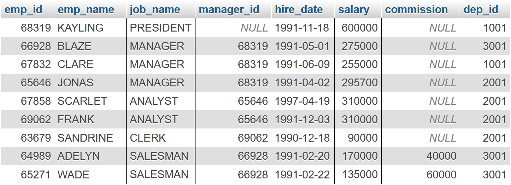

::: {#cover.border}

<section>
	
</section>
<section>
	<p class="h1 w800 underline text-upr">Lab Report</p>
	<table class="compact borderless table-large table-upr padless" style="width: 5.1in">
		<tr>
			<th>Course Title</th>
			<th>:</th><td>Database Systems Lab</td>
		</tr>
		<tr>
			<th>Course Code</th>
			<th>:</th><td>CSE 208</td>
		</tr>
		<tr>
			<th>Lab Report No.</th>
			<th>:</th><td>06</td>
		</tr>
		<tr>
			<th>Submission Date</th>
			<th>:</th><td>03-09-2025</td>
		</tr>
	</table>
</section>
<section style="--hw: 7.2rem;">
	<p class="h2 w800 text-upr">Submitted To</p>
	<table class="compact borderless table-large table-upr padless withleader">
		<tr>
			<th>Name</th>
			<td>Farha Akhter Munmun</td>
		</tr>
		<tr>
			<th>Dept. of</th>
			<td>Computer Science and Engineering (CSE)</td>
		</tr>
		<tr>
			<th></th>
			<td>Bangladesh University of Business & Technology (BUBT)</td>
		</tr>
	</table>
</section>
<section style="--hw: 7.2rem;">
	<p class="h2 w800 text-upr">Submitted By</p>
	<table class="compact borderless table-large table-upr padless withleader">
		<tr>
			<th>Name</th>
			<td>Shadman Shahriar</td>
		</tr>
		<tr>
			<th>ID No.</th>
			<td>20245103408</td>
		</tr>
		<tr>
			<th>Intake</th>
			<td>53</td>
		</tr>
		<tr>
			<th>Section</th>
			<td>1</td>
		</tr>
		<tr>
			<th>Program</th>
			<td>B.Sc. Engg. in CSE</td>
		</tr>
	</table>
</section>

:::

::: {.centered-heading}

# Database Systems Lab

:::

## Prerequisite

Create a database named **company**:

```sql
CREATE DATABASE company;
```

Create two tables: `employee` and `department`:

```sql
CREATE TABLE employee(
	emp_id int(6),
	emp_name varchar(12),
	job_name varchar(16),
	manager_id int(6),
	hire_date varchar(12),
	salary int(8),
	commission int(8),
	dep_id int(4)
);

CREATE TABLE department(
	dep_id int(4),
	dep_name varchar(16),
	dep_location varchar(24)
);
```

Inserting data into the tables:

```sql
-- Inserting data into `employee`
INSERT INTO employee VALUES(68319, "KAYLING", "PRESIDENT", NULL, "1991-11-18", 600000, NULL, 1001);
INSERT INTO employee VALUES(66928, "BLAZE", "MANAGER", 68319, "1991-05-01", 275000, NULL, 3001);
INSERT INTO employee VALUES(67832, "CLARE", "MANAGER", 68319, "1991-06-09", 255000, NULL, 1001);
INSERT INTO employee VALUES(65646, "JONAS", "MANAGER", 68319, "1991-04-02", 295700, NULL, 2001);
INSERT INTO employee VALUES(67858, "SCARLET", "ANALYST", 65646, "1997-04-19", 310000, NULL, 2001);
INSERT INTO employee VALUES(69062, "FRANK", "ANALYST", 65646, "1991-12-03", 310000, NULL, 2001);
INSERT INTO employee VALUES(63679, "SANDRINE", "CLERK", 69062, "1990-12-18", 90000, NULL, 2001);
INSERT INTO employee VALUES(64989, "ADELYN", "SALESMAN", 66928, "1991-02-20", 170000, 40000, 3001);
INSERT INTO employee VALUES(65271, "WADE", "SALESMAN", 66928, "1991-02-22", 135000, 60000, 3001);

-- Inserting data into `department`
INSERT INTO department VALUES(1001, "FINANCE", "SYDNEY");
INSERT INTO department VALUES(2001, "AUDIT", "MELBOURNE");
INSERT INTO department VALUES(3001, "MARKETING", "PERTH");
INSERT INTO department VALUES(4001, "PRODUCTION", "BRISBANE");
```





## Lab Tasks

### 1. Employee Details

From the following table, write a SQL query to find **employees** along with their **department details**.

Return `employee ID`, `employee name`, `job name`, `manager ID`, `hire date`, `salary`, `commission`, `department ID`, and `department name`.

```sql
SELECT * FROM employee NATURAL JOIN department;
```



### 2. Well Paid Employees

From the following table, write a SQL query to identify those employees who earn **60000 or more** per year _or_ **DO NOT work as ANALYST**.

```sql
SELECT * FROM employee
WHERE salary >= 60000 OR job_name != "ANALYST";
```



### 3. Third Highest Paid Employee

Find the **third highest salary** of the employee.

```sql
SELECT salary FROM employee
ORDER BY salary DESC LIMIT 2, 1
```


