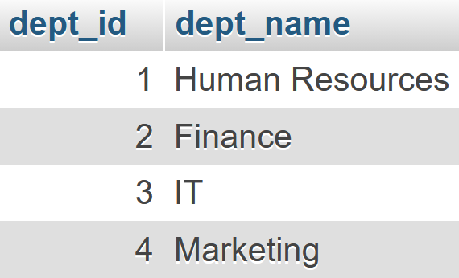
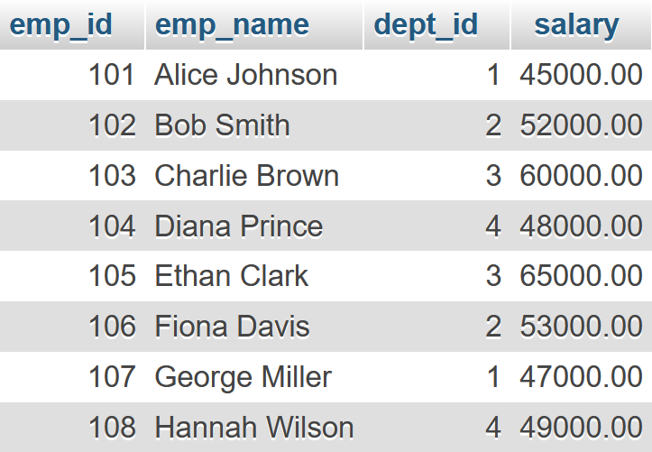
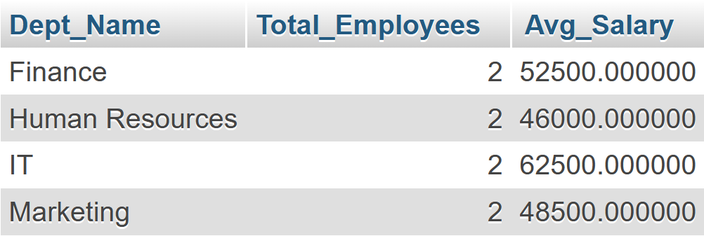
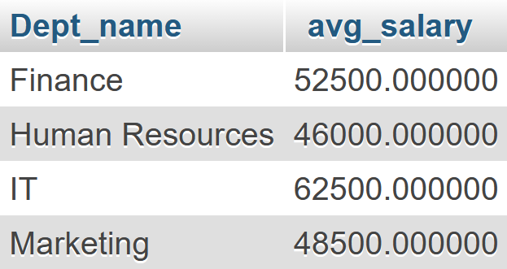
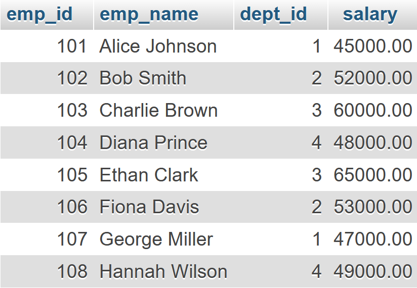
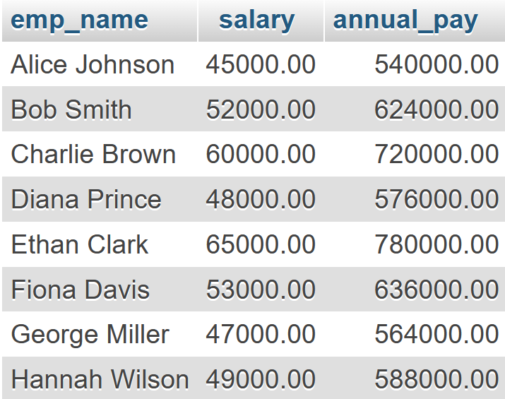
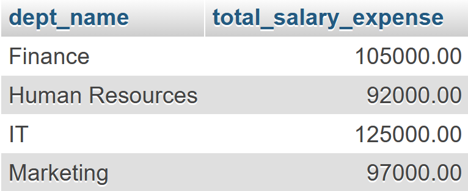
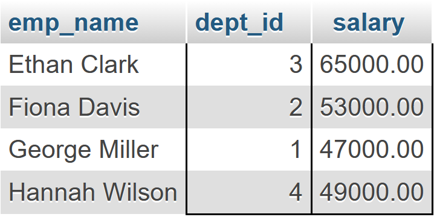

# Eight Lab

## Prerequisite

Create a database named **company**:

```sql
CREATE DATABASE company;
```

Create two tables: `employee` and `department`:

```sql
CREATE TABLE employee(
	emp_id int(5),
	emp_name varchar(20),
	dept_id int(3),
	salary decimal(10, 2)
);

CREATE TABLE department(
	dept_id int(3),
	dept_name varchar(20)
);
```

Inserting data into the tables:

```sql
-- Inserting data into `employee`
INSERT INTO employee VALUES(101, "Alice Johnson", 1, 45000.00);
INSERT INTO employee VALUES(102, "Bob Smith", 2, 52000.00);
INSERT INTO employee VALUES(103, "Charlie Brown", 3, 60000.00);
INSERT INTO employee VALUES(104, "Diana Prince", 4, 48000.00);
INSERT INTO employee VALUES(105, "Ethan Clark", 3, 65000.00);
INSERT INTO employee VALUES(106, "Fiona Davis", 2, 53000.00);
INSERT INTO employee VALUES(107, "George Miller", 1, 47000.00);
INSERT INTO employee VALUES(108, "Hannah Wilson", 4, 49000.00);


-- Inserting data into `department`
INSERT INTO department VALUES(1, "Human Resources");
INSERT INTO department VALUES(2, "Finance");
INSERT INTO department VALUES(3, "IT");
INSERT INTO department VALUES(4, "Marketing");
```

<p align="center">


</p>

# Lab Tasks

### 1. Create a view called showing each department name, total number of employees, and average salary.

```sql
CREATE VIEW dept_stats AS
SELECT
	d.dept_name,
	COUNT(e.emp_id) AS total_employees,
	AVG(e.salary) AS avg_salary
	FROM department d JOIN employee e
	ON d.dept_id = e.dept_id
	GROUP BY d.dept_name;
```



### 2. Display departments where the average salary exceeds 10,000.

```sql
SELECT
	d.dept_name,
	AVG(e.salary) AS avg_salary
	FROM department AS d JOIN employee AS e
	ON e.dept_id = d.dept_id
	GROUP BY d.dept_name
	HAVING AVG(e.salary) > 10000;
```



### 3. A manager wants to increase all salaries in the "Sales" department by 5%. Write an UPDATE query that achieves this in one step.

```sql
UPDATE employee
SET salary = salary * 1.05
WHERE dept_id = (
    SELECT dept_id
    FROM department
    WHERE dept_name = 'Sales'
);
```



### 4. Use a function in a `SELECT` statement to show each employee's annual pay.

```sql
SELECT emp_name, salary, (salary * 12) AS annual_pay FROM employee;
```



### 5. Write a query to show each department and its total salary expense, but display only departments spending more than 50,000.

```sql
SELECT d.dept_name, SUM(e.salary) AS total_salary_expense
FROM department d JOIN employee e
ON d.dept_id = e.dept_id
GROUP BY d.dept_name
HAVING SUM(e.salary) > 50000;
```



### 6. Display the employees whose salary is greater than their department's average salary.

```sql
SELECT e.emp_name, e.dept_id, e.salary
FROM employee e
WHERE e.salary > (
	SELECT AVG(salary)
	FROM employee
	WHERE dept_id = e.dept_id
);
```


